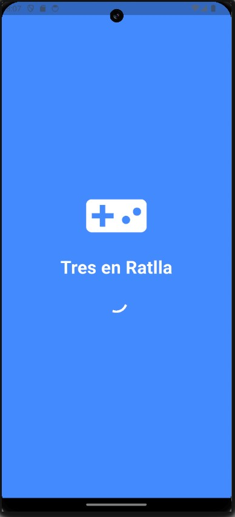
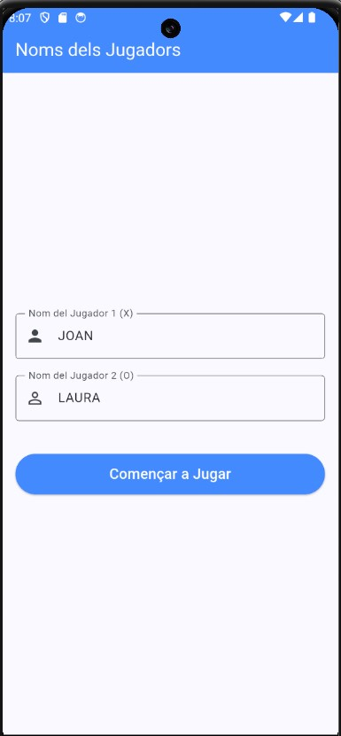
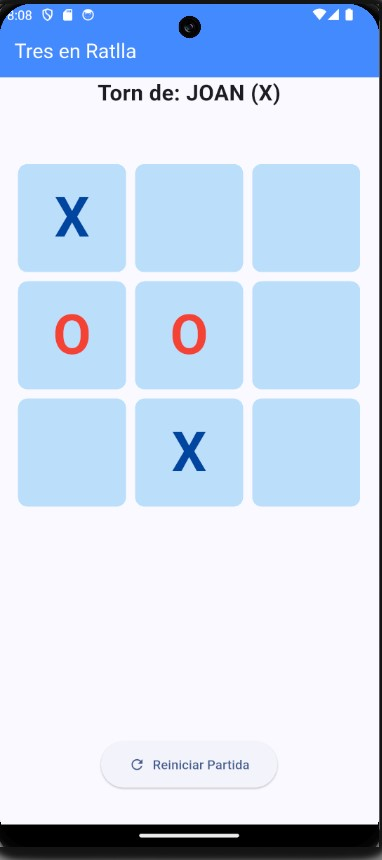
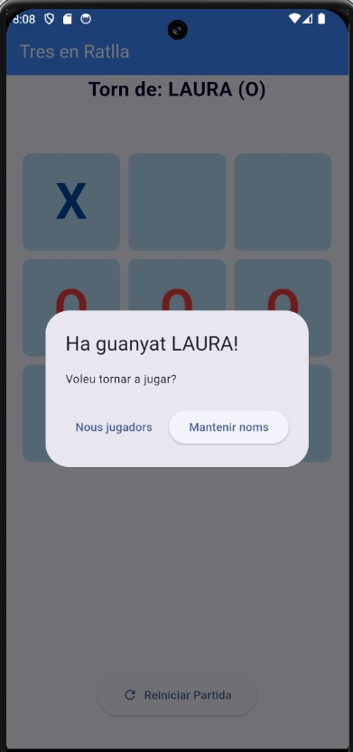

# 🎮 Tres en Ratlla - Projecte Flutter

Aquest projecte és una aplicació de **Tres en Ratlla** desenvolupada amb **Flutter** com a part del curs de **Desenvolupament d'Apps Multiplataforma (DAM)**. L'objectiu és demostrar l'ús de ginys (widgets), animacions, gestió d'estats i el cicle de vida d'una aplicació Android/iOS.

## 🚀 Característiques Principals

L'aplicació està dividida en tres funcionalitats principals organitzades per carpetes:

1.  **Splash Screen Animada**:
    *   Pantalla de càrrega inicial de 6 segons.
    *   Inclou una animació d'escala (`ScaleTransition`) sobre una icona de comandament de joc.
    *   Transició automàtica cap a la selecció de jugadors.

2.  **Selecció de Jugadors**:
    *   Formulari per introduir els noms dels dos jugadors.
    *   Validació de dades: no permet començar sense haver introduït els noms.
    *   Disseny amb `TextFormField` i icones descriptives.

3.  **Lògica del Joc**:
    *   Tauler interactiu de 3x3 amb detecció de torns.
    *   Identificació visual de fitxes: Blau fosc per a la **X** i Vermell per a la **O**.
    *   **Detecció de guanyador i empat** mitjançant algoritmes de cerca en el tauler.
    *   **Diàlegs de final de partida**: Opcions per reiniciar la partida mantenint els mateixos jugadors o canviar de jugadors.

4.  **Cicle de Vida**:
    *   Implementació de `WidgetsBindingObserver` per detectar quan l'usuari surt i torna a l'aplicació.
    *   Missatges aleatoris de benvinguda mitjançant `SnackBar` quan l'app torna del segon pla.

## 🛠️ Estructura del Projecte

El codi segueix una arquitectura neta basada en funcionalitats (`features`):

```text
lib/
├── features/
│   ├── game/       # Lògica i pantalla del tauler de joc
│   ├── players/    # Pantalla de registre i validació de jugadors
│   └── splash/     # Pantalla de càrrega animada
└── main.dart       # Punt d'entrada de l'aplicació
```

## 📦 Instal·lació i Execució

Per executar aquest projecte localment, assegura't de tenir Flutter instal·lat al teu sistema:

1.  Clona aquest repositori.
2.  Executa `flutter pub get` per instal·lar les dependències.
3.  Connecta un dispositiu o emulador.
4.  Executa l'aplicació amb:
    ```bash
    flutter run
    ```

## 📸 Captures de Pantalla -



    

---
**Curs**: Desenvolupament d'Apps Multiplataforma
**Tecnologia**: Flutter & Dart
**Autor**: Miguel A. P.
